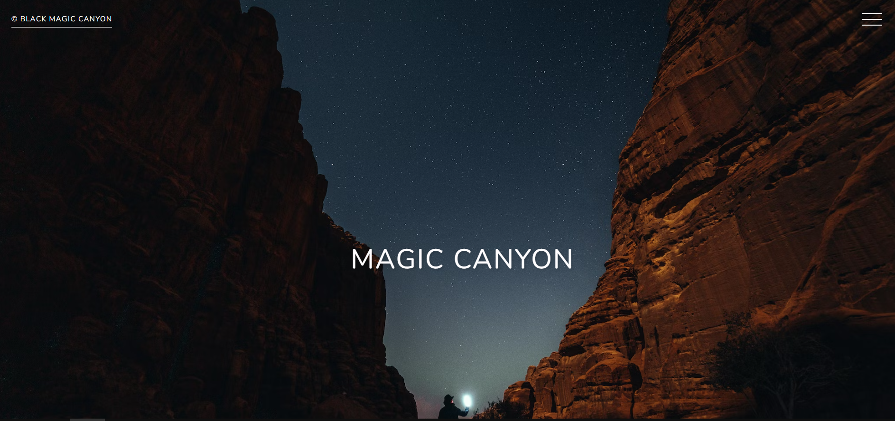
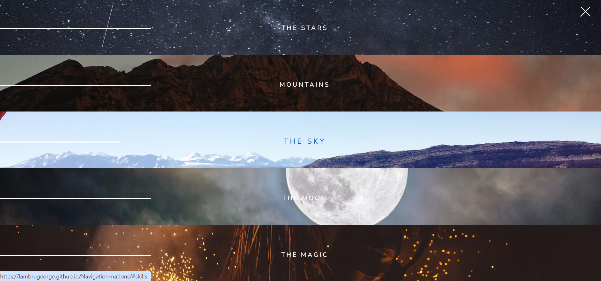

# Navigation-nations
**Magic Canyon - Interactive Site with Animated Navigation**

## LIVE DEMO
[Demo Link](https://lambrugeorge.github.io/Navigation-nations/)

## Description

This project is an interactive website with animated navigation, created with HTML, CSS, and JavaScript. The site has five themed sections, each with its own animated background and scroll effects.

## Key Features

- Interactive navigation with opening and closing animations.
- Themed sections with background images and customized text.
- Hover effects for menu items and section titles.

## How to Use

1. Clone this repository: `git clone repository_link.git`
2. Open `index.html` in a modern web browser.

## Contribute

Contributions are welcome! If you want to add new features, make improvements, or report issues, please open an issue or send a pull request.

This project is designed by [ZtM Academy].
